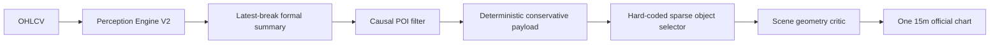
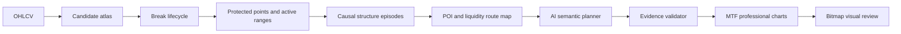

# SMC Causal Structure, POI Story, and Annotation Audit

Date: 2026-07-12

## Decision

`NOT_YET_EXPERT_PERCEPTION_OR_IMPECCABLE_ANNOTATION`

The desk is materially better than it was. It has trustworthy OHLCV handling,
causality-aware detector objects, parent/child guards, POI lineage checks,
observe-only authority boundaries, a formal-graph contract, and a sparse
annotation renderer. Those are real achievements.

It still does not reliably read a chart as one coherent SMC episode. The main
failure is not missing colors or labels. It is **authority fragmentation**:
the official live path uses a simpler structure detector and a latest-event
summary, while the stronger lifecycle, protected-point, range, interaction,
six-role AI, and annotation-research components remain experimental or only
partly integrated.

The result is predictable:

1. a weak or incomplete structure event can become the controlling break;
2. POI lineage is then built on that event;
3. the formal graph keeps only the latest summary rather than the causal
   sequence;
4. a deterministic selector chooses one POI and at most two structure marks;
5. a geometry critic confirms that the small scene is tidy;
6. the final chart can be valid by software contract but incomplete to an SMC
   trader.

This is why the user can still see a protected extreme, deeper OB, inducement,
or unbroken parent structure that the official chart does not explain.

## What The Official System Actually Does



The live command calls `build_conservative_ai_payload` through a
`LOCAL_DETERMINISTIC_PROVIDER`; it does not run a chart-reading AI panel. See
`tools/run_live_ai_smc_full_system.py:52-58`.

The stronger experimental direction is different:



That second pipeline is the correct target. It is not yet the single canonical
runtime.

## Root Causes

### 1. Canonical break semantics are too permissive and internally inconsistent

`smc_desk/perception/structure.py:168-176` calls the first
direction-establishing break a BOS because no prior direction is treated as a
continuation. A first break has not continued an established structural trend.

The same module confirms a break when price body-closes beyond the level
(`structure.py:251-275`). It records ATR penetration and displacement strength
as zero (`structure.py:195-210`) and does not require either for confirmation.
The pending wick probe also has no explicit bar expiry in this path.

Therefore the canonical engine does not yet make the full distinction between:

- wick probe;
- body-close candidate;
- initial direction break;
- internal CHoCH;
- external continuation BOS;
- external MSS candidate;
- external reversal confirmed by displacement and acceptance.

The experimental break engine models most of this, but it is not the official
authority.

### 2. The formal structure graph is a summary object, not a causal graph

`smc_desk/perception/formal_structure_graph.py:70-105` stores the latest
external break, latest internal break, object counts, and protected levels for
each timeframe. It does not preserve a connected sequence of structural legs.

The missing episode is:

```text
protected point -> liquidity probe/sweep -> accepted break -> impulse leg
-> origin POI -> retrace/mitigation -> internal confirmation -> liquidity draw
```

Parent/child guarding is useful, but `formal_structure_graph.py:153-237`
reduces disagreements to the first conflict and a final `mixed`/aligned
summary. That prevents false promotion, but it does not explain the whole
market story.

### 3. Richer structural state machines are not canonical live authority

The repo contains richer implementations for protected points, range
lifecycles, and multi-horizon level interactions under `smc_desk/structure/`.
They model the right concepts, but the production live path still resolves its
active range with a separate latest swing-pair authority. The stronger objects
are mainly exercised by the experimental programme and tests.

This creates two truths:

- a conservative official snapshot truth;
- a richer experimental causal truth.

Until one canonical engine owns both, downstream AI and annotation cannot have
stable context.

### 4. POI selection is downstream-causal but upstream-fragile

The causal POI authority correctly prevents an FVG from being relabelled as an
OB and preserves directional scenarios. That repair is valuable.

However, an OB or POI is linked to a canonical structure break. If the break
was accepted with weak semantics, the POI can have impeccable lineage to the
wrong structural event. The order-block origin logic also prefers a contiguous
opposing candle cluster; it does not yet fully score base compression,
departure efficiency, displacement acceptance, protected-extreme ownership,
or empirical reaction quality.

The current FVG detector is primarily geometric. Its configured displacement
factor is not the canonical acceptance gate, so an imbalance can be real as a
gap but weak as a causally important POI.

The deeper-versus-shallow OB question therefore remains only partly solved.
The system needs explicit roles:

- `protected_origin_ob`: deepest origin defending the accepted external leg;
- `continuation_ob`: shallow origin inside continuation structure;
- `execution_refinement`: lower-timeframe refinement inside an accepted parent
  POI;
- `secondary_fvg`: imbalance supporting the route, never silently promoted to
  OB;
- `invalid_or_consumed`: no longer available as a reaction hypothesis.

### 5. Inducement is detected as an object, not understood as a route hypothesis

The current inducement detector can identify an intermediate internal swing,
but the official scenario and annotation path do not preserve a full lifecycle:

```text
resting internal liquidity -> touch/sweep -> deeper POI remains valid
-> reaction/confirmation -> target liquidity
```

Because this route is absent, the annotation often jumps directly from POI to
BOS or target. That is visually sparse, but not narratively complete.

### 6. The annotation planner is not actually an AI chart planner

`smc_desk/brain/annotation_candidate_composer.py:85-168` is a deterministic
selector. It chooses one active/scenario POI, then hard-codes 1H and 15m latest
structure anchors, adds an optional range target/path, and truncates the plan
to four objects.

`annotation_candidate_composer.py:198-229` does not semantically compare all
material protected points, sweeps, inducement, displacement legs, alternate
POIs, or draws on liquidity. It is conservative by design, but it cannot think
like a professional annotator.

The six-role AI structure lab exists and is directionally correct. The official
live command does not use it to produce the final semantic drawing plan.

### 7. The visual critic reviews metadata, not the rendered chart

`smc_desk/brain/annotation_visual_critic.py:23-59` reviews scene objects and
rough overlap geometry. It does not inspect the PNG. It skips POI overlap
checks (`annotation_visual_critic.py:98-101`) and cannot judge whether:

- a line visually connects the intended swing and break;
- a zone remains active through its first mitigation/current endpoint;
- labels are professionally placed after real pixel rendering;
- a chart resembles the supplied professional examples;
- the visible objects collectively tell the correct story.

The renderer also limits context/watch charts to three visible objects
(`smc_desk/rendering/smc_trader_annotation_renderer.py:30-41` and
`:492-512`). That keeps charts clean, but it can hide indispensable story
objects because there is no timeframe-specific composition.

### 8. One projected 15m chart cannot carry the full MTF story cleanly

The official chart projects 1H and 15m marks onto one 15m canvas. This is
sometimes useful, but it forces HTF structures into long spans and loses the
native swing context that made the HTF mark meaningful.

Professional output should be a coordinated set:

- 4H context: external leg, protected point/range, HTF liquidity, HTF POI;
- 1H setup: parent/child transition, sweep, displacement, primary and
  secondary POIs, inducement;
- 15m execution/watch: local confirmation structure and only the actionable
  local marks;
- optional three-panel story mosaic.

### 9. There is no expert accuracy measurement yet

The fresh gold-readiness audit returned:

```text
status: INSUFFICIENT_GROUND_TRUTH
adjudicated_case_count: 0
invalid_case_count: 301
engine_weak_labels_promoted_to_gold: false
```

This means the suite proves deterministic behavior and software contracts; it
does not prove that the engine agrees with expert SMC annotations. The existing
case files are not valid adjudicated gold under the current schema.

The system is being honest here. We must not translate `984 passed` into
“expert perception achieved.”

## Practitioner Cross-Check

SMC terminology is not a scientifically standardized ontology, and no source
can guarantee that a zone will react or that a strategy has an edge. Still,
established implementations reinforce several requirements in this audit:

- LuxAlgo documents BOS as continuation and CHoCH as a possible reversal,
  separates internal from swing structure, and warns that confirmed swing
  points are retrospective:
  https://docs.luxalgo.com/docs/algos/price-action-concepts/market-structures
- Its order-block tooling manages mitigation state and MTF identity rather
  than treating every opposing candle as an enduring POI:
  https://docs.luxalgo.com/docs/algos/price-action-concepts/order-blocks
- Its liquidity tooling treats equal levels and grabs as separate contextual
  objects:
  https://docs.luxalgo.com/docs/algos/price-action-concepts/liquidity

These references support the architectural need for scope, lifecycle, and
state. They do not establish predictive truth.

## Capability Scorecard

| Capability | Current Level | Strict Verdict |
|---|---:|---|
| OHLCV/provenance/causality guards | 8.5/10 | Strong local foundation |
| Candidate object generation | 7/10 | Broad, still needs canonical semantics |
| Canonical external/internal structure | 5/10 | Guarded but too permissive |
| Causal structural story | 3.5/10 | Latest-event summary, not episode graph |
| POI identity and lineage | 6/10 | Improved, inherits break weakness |
| Deep vs shallow POI reasoning | 4.5/10 | Roles not yet formally represented |
| Liquidity/inducement route model | 4/10 | Objects exist; story integration weak |
| AI semantic chart planning | 3/10 | Research path exists; live path deterministic |
| Annotation geometry/rendering | 6/10 | Safer and cleaner, but context-poor |
| Bitmap visual self-review | 2/10 | Scene review only |
| Expert perception evidence | 0/10 | Zero valid adjudicated cases |

## Correct Repair Order

### Phase A - One Canonical Structure Authority

1. Promote the experimental break lifecycle into a shadow `StructureEngineV3`.
2. Make `INITIAL_DIRECTION_BREAK`, `INTERNAL_CHOCH`, `EXTERNAL_BOS`,
   `EXTERNAL_MSS_CANDIDATE`, and `EXTERNAL_MSS_CONFIRMED` distinct states.
3. Add wick-probe expiry, ATR-normalized penetration, displacement, and
   follow-through/retest acceptance.
4. Make thresholds timeframe- and volatility-aware without letting them tune
   themselves on the holdout.
5. Replay V2 and V3 side by side before replacing authority.

### Phase B - Causal Structure Episode Graph

Build `formal_mtf_structure_graph_v2` as typed nodes and edges, not counters:

```text
Swing --protects--> Leg
Leg --breaks--> Swing
Break --confirmed_by--> Displacement
Break --originates_from--> POI
Liquidity --swept_by--> Candle
POI --mitigated_by--> Candle
ChildLeg --subordinate_to--> ParentLeg
Scenario --targets--> Liquidity
```

The graph must retain recent episodes and explain why the current episode owns
the active range, protected point, POI, invalidation, and draw on liquidity.

### Phase C - POI and Route Authority

1. Select OBs only after the accepted structural episode is known.
2. Score origin ownership, base quality, departure displacement, freshness,
   mitigation, range location, liquidity route, and confirmation compatibility.
3. Preserve primary protected-origin OB, secondary continuation OB, and LTF
   refinement as different roles.
4. Keep FVG identity explicit and subordinate unless the accepted scenario
   truly has no eligible OB.
5. Model inducement as a lifecycle hypothesis with `resting`, `taken`,
   `failed`, and `resolved` states.

### Phase D - Real AI Annotation Planning

1. Run the six-role AI structure lab against the sealed episode graph.
2. Require the AI to produce a semantic annotation storyboard before prose.
3. Let deterministic validators reject invented identities, prices, scopes, or
   unsupported relationships.
4. Render native 4H, 1H, and 15m plans plus a story mosaic.
5. Extend POI zones from origin to first mitigation/current validity endpoint;
   preserve source and confirmation anchors separately.
6. Perform real bitmap review with a maximum of two revise/render passes.

AI should choose relevance and narrative. Deterministic code should own market
coordinates, timestamps, object identity, lifecycle facts, and authority gates.

### Phase E - Truth Measurement

1. Repair the review/import schema mismatch.
2. Freeze 50-100 difficult cases across crypto, forex, and gold.
3. Require two independent reviews plus adjudication.
4. Measure structure-event precision/recall, episode exact match, protected
   point agreement, POI rank agreement, abstention quality, and annotation
   readability.
5. Do not claim expert perception until the locked cohort passes declared
   thresholds.

## Non-Negotiable Acceptance Criteria

The repair is complete only when all of these are true:

- one canonical authority owns swings, breaks, protected points, ranges, and
  interaction lifecycles;
- every displayed BOS/CHoCH/MSS has a typed event and exact swing-to-break
  evidence;
- the current structure can be replayed as a causal episode, not reconstructed
  from latest labels;
- primary, secondary, and refinement POIs are explicitly different roles;
- every scenario explains inducement/liquidity, POI, confirmation,
  invalidation, and target;
- AI produces the semantic drawing plan from sealed evidence;
- deterministic validation can only preserve or downgrade that plan;
- the final PNG is actually inspected and can trigger a revision;
- 4H, 1H, and 15m charts agree without flattening their scopes;
- a locked adjudicated cohort demonstrates accuracy and honest abstention.

## Final Answer To "Why Don't We Have It Yet?"

Because the project has been solving the right subproblems in parallel, but it
has not yet made them one official causal authority. The current renderer is
being asked to create an expert chart from a compressed latest-event summary,
and the current “AI” live provider is a deterministic conservative payload
builder. Clean output cannot recover structural context that was discarded
before annotation.

The next move is not another renderer tweak. It is **Structure Engine V3 plus
Formal Causal Episode Graph V2 in shadow mode**, followed by POI route authority
and the real AI annotation planner. That sequence fixes the mind before the
handwriting.
