# SMC Perception Interrogation Hardening

## Bottom Line

The repository now has `100/100` implementation coverage for the internally addressable interrogation contract. It does **not** have 100% perception accuracy, and it does not emit a substitute 99 score. The empirical verdict remains `NOT_CERTIFIED` until independent evidence is supplied.

The historical 45.1/100 self-audit remains useful as the pre-repair baseline. The new result closes the engineering gaps it identified: mutable geometry, incomplete evidence contracts, pseudo-confidence, unsealed POI selection, under-specified sweep lifecycle, and non-executable adversarial gates.

## What Changed

```mermaid
flowchart LR
    A["Completed OHLCV"] --> B["Perception objects"]
    B --> C["Immutable evidence contracts"]
    C --> D["Formal graph and causal replay"]
    D --> E["AI thesis and sparse annotation"]
    E --> F["Geometry and semantic validators"]
    F --> G["Runtime causality and POI freeze"]
    G --> H["Empirical certification gate"]
    H -->|"gold missing"| I["NOT CERTIFIED"]
```

- Evidence geometry is immutable and hash-sealed; display clipping cannot move market truth.
- Every exported object carries explicit evidence, timing, causality, alternatives, invalidation, and doctrine assumptions.
- Heuristic strength is no longer called probability. Confidence is unavailable until calibrated.
- POIs are frozen before outcomes and reject future-reaction fields.
- Sweeps are lifecycle objects, not one-candle labels.
- Certification loads only valid human-adjudicated cases and linked calibration rows.
- Missing visual, abstention, and sweep/breakout reports fail closed but can legitimately unlock when supplied.

## Research Scope

[RefChartQA](https://arxiv.org/abs/2503.23131) supports answer-to-chart-element grounding, not candlestick or SMC competence. [Thinking with Visual Grounding](https://arxiv.org/abs/2606.16122) supports explicit visual-region grounding, also not trading-specific. [Look-Ahead-Bench](https://arxiv.org/abs/2601.13770) supports point-in-time financial evaluation, but does not itself prove this repository's candle-cutoff integrity. The unsupported claim that RefChartQA found stronger performance in persistent market trends has been removed.

## Fresh BTC Evidence

The final observe-only run is at `analysis_runs/PERCEPTION_INTERROGATION_HARDENING_FINAL_20260713/LIVE_FULL_SYSTEM_AI_SMC_V3_20260713_000734/BTCUSDT`.

- 5,772/5,772 complete evidence contracts; no duplicate contract IDs.
- Runtime causality `PASS`: 480 candles and all 5,772 contracts, zero violations.
- POI ranking `FROZEN_VALID`: two POIs, zero contamination violations.
- Annotation `VALIDATED`: two sparse, local structure segments and no trade box.
- Seven perturbation images generated.
- Official state `REVIEW_REQUIRED`, correctly refusing promotion while V1/V3 structure lineage conflicts remain.

## Validation

`1015 passed, 1 skipped`; focused hardening tests `68 passed`; compileall and `git diff --check` passed.

## What Is Still Required

Real certification needs at least 30 independently adjudicated cases, 50 linked calibration records, point-in-time sweep/breakout gold replay, real visual perturbation responses, and real no-evidence abstention responses. Those are data-collection and independent-review requirements. Fabricating them would defeat the entire purpose of the system.
